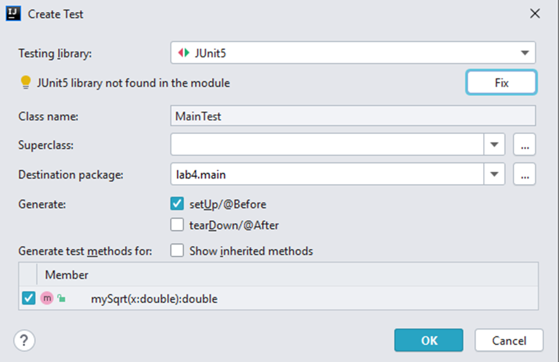

= Основи сучасних технологій розробки мовою Java

== Система автоматизації збирання проектів Maven та модульного тестування JUnit

Назва системи `Maven` є словом з мови ідиш, сенс якого можна приблизно висловити як «збирач знання»

Зібрати на Java проект рівня «Hello, world!» можна і за допомогою командного рядка. Але чим складніше ПЗ, що розробляється, і чим більше воно використовує сторонніх бібліотек і ресурсів, тим складніше буде команда для збирання. Maven розроблений для полегшення цієї роботи.

Одна з головних особливостей системи - декларативний опис проекту. Це означає, що розробнику не потрібно приділяти увагу кожному аспекту збирання — всі необхідні параметри налаштовані за замовчуванням. Зміни потрібно вносити лише в тому обсязі, в якому програміст хоче відхилитися від стандартних налаштувань.

Ще одна перевага проекту — гнучке управління залежностями. Maven вміє довантажувати у свій локальний репозиторій сторонні бібліотеки, вибирати необхідну версію пакету, обробляти транзитивні залежності.

Розробники також підкреслюють незалежність системи від ОС. При роботі з командного рядка параметри залежать від платформи, але Maven дозволяє не звертати уваги на цей аспект.

При необхідності систему збирання можна налаштувати під власні потреби, використовуючи готові плагіни та архетипи. А якщо нічого слушного не знайшлося — можна написати свої.

=== Створення проекту на основі Maven

Створюємо в IntelliJ IDEA новий проект. У якості типу проекту обираємо `Maven`.

Після натискання на кнопку *Next* потрапляэму у звичне вікно вибору місця  розміщення проекту:

Після створення проекту відкриємо файл `pom.xml`, який містить опис початкової структури проекту.

Створимо головний клас програми. Для цього правою кнопкою миші (ПКМ) треба клацнути на вузлі java. Вибрати `New` -> `Java Class`

та ввести ім'я класу. Також, можна вказати повне ім'я, включаючи всі вкладені пакети.

Тепер можна додавати будь-які методи, змінні та ін.

Але ми переходимо до використання фреймворку для модульного тестування JUnit

=== Використання JUnit

JUnit - це модульна система тестування для мови програмування Java. JUnit має важливе значення в розробці тестових розробок і є одним із сімейства модульних модулів тестування, який разом відомий як xUnit, що походить від SUnit.

JUnit підключається як JAR під час компіляції. Остання версія фреймворку, JUnit 5, знаходиться в пакеті `org.junit.jupiter`. Попередні версії JUnit 4 та JUnit 3 знаходились у пакетах `org.junit` та `junit.framework`, відповідно.

Дослідження, проведене у 2013 р показало, що серед 10000 проектів Java, розміщених на GitHub, JUnit (у поєднанні з slf4j-api) є найбільш частою зовнішньою бібліотекою. Кожна бібліотека була використана у 30,7% проектів.

Методика використання модульного тестування із використанням JUnit лежить в основі технології TDD (Test Driven Development).

Тому, продовжимо створювати наш проєкт за допомогою TDD.

Додамо до раніше створеного класу опис нового метода. Та в операторі return цього метода, вкажемо значення "заглушку" - 0

Вибираємо в коді цей метод (встановлюємо курсор на нього). Натискаємо ПКМ та обираємо Goto -> Test (або сполучення клавіш Ctrl+Shift+T)

Оскільки тесту ще немає, то з'являється меню, що пропонує його створити:

Відкриється вікно створення тесту. Якщо у ньому є повідомлення "JUnit5 library not found in the module" треба один раз натиснути кнопку `Fix` та відмітити пункти у вікні згідно з рисунком.

Буде створений тестовий клас MainTest, що містить текст подібний до наступного рисунка:

Можливо, текст у файлі буде трохи інакший, в такому випадку його можна виправити, щоб він виглядав, як на рисунку вище.

Переглянувши файл pom.xml, можна побачити, що в ньому з'явився розділ dependencies, де підключена одна "залежність" (термін Maven): `junit-jupiter`

Прив'яжемо тестовий клас до основного, для цього додамо опис основного класу:

`Main main;`

У методі setUp треба виконати початкову ініціалізацію об'єкта main (створюємо новий об'єкт). Цей метод буде викликатися перед виконанням кожного тестового методу.

`main = new Main();`

Розробимо логіку тестування:

* вкажемо значення аргументу функції `double x = 2.0;`
* вкажемо, значення функції, що очікується як результат `double expected = 1.4142;`
* викликаємо функцію, що тестується, та зберігаємо її результат `double result = main.mySqrt(x);`
* порівнюємо результат з очікуваним. Для порівняння дробних чисел треба вказувати припустиму похибку порівняння. Оскільки у нас очікуване значення вказане з точністю 4 знаки, то вкажемо похибку 10^-4^
`assertEquals(expected, result, 1e-4);`

Одразу ж виконаємо тестування, та пересвідчимося, що тест "не проходить"

image::img/lab4_13.png[]

виправимо нашу функцію так, щоб вона правильно обчислювала значення згідно завдання:

Знову виконуємо тест

Бачимо, що на цей раз все добре:

Аналогічно додаємо та тестуємо інші функції. Після успішного проходження всіх тестів створюємо методи, що викликають вже протестовані та, таким чином реалізують програмну логіку.

== Управляючі структури мови Java

У мові Java існують управляючі структури, аналогічні до тих, що є у С++, але тут розглянемо ті, що відсутні у С++:

.  *switch* +
Конструкція `switch` у Java як і у С++ дозволяє передавати управління тому чи іншому блоку коду, що позначений іменованою міткою, в залежності від значення виразу. Загальний синтаксис switch можна представити таким чином:

[source,java]
----
switch (Вираз) {
case n: Інструкції
case m: Інструкції
...
default: Інструкції
}
----
Тіло `switch`, відоме як блок перемикачів, містить набори інструкцій, яким передують мітки, що починаються зі службового слова `case`. Кожній мітці `case` ставиться у відповідність константа.
Якщо значення виразу збігається із значенням деякої мітки, управління буде передано першій інструкції, що йде після цієї мітки. Якщо збігів не знайдено, виконуються інструкції блоку `default`.
Якщо ж мітка `default` відсутня, виконання `switch` завершується. При передаванні управління відповідній мітці виконуються всі наступні за нею інструкції, навіть ті, що мають свої власні мітки `case`.

Якщо треба вийти з блоку `switch`, треба використати інструкцію `break`.

На відміну від С++, у Java у якості виразу та міток перемикачів, дозволяється використовувати не тільки цілі числа, а й рядки.

[start=2]
. *for (each)* +
Починаючи з версії Java 5 у мові Java з’явилась нова конструкція, призначена для виконання ітерації по масиву або колекції. Вона виглядає так:
[source,java]
for (<тип елементу> <формальна змінна> : <масив>) Інструкція

. *Мітки* +
Інструкції програми можуть бути позначені мітками (labels). Мітка являє собою змістовне ім’я, що дозволяє посилатися на відповідну інструкцію:
`Мітка: Інструкція` +
Звертатися до мітки дозволено тільки за допомогою команд break та continue (вони розглядатимуться далі).

. *break* +
Інструкція `break` застосовується для завершення виконання коду будь-якого блоку. Існують дві форми інструкції – безіменна:
[source]
----
break;
----
та іменована
[source]
----
break мітка;
----

Безіменна команда `break` перериває виконання коду конструкцій `switch`, `for`, `while` або `do` і може використовуватися лише всередині цих конструкцій. Команда `break` у іменованій формі може перервати виконання будь-якої інструкції, що помічена відповідною міткою.

Команда `break` найчастіше використовується для примусового виходу з тіла циклу. А для виходу із вкладеного циклу чи блоку, достатньо позначити міткою зовнішній блок і вказати її в інструкції break як показано в наступному прикладі:

*Приклад. Використання поміченого `break`*

[source,java]
----
private float[][] matrix;
public boolean workOnFlag(float flag) {
    int y, x;
    boolean found = false;
    search:
        for (y = 0; y < matrix.length; y++) {
            for (x = 0; x < matrix[y].length; x++) {
                if (matrix[y][x] == flag) {
                    found = true;
                    break search;
                }
            }
        }
        if (!found) {
            return false;
        }
        // А тут знайдене значення matrix[y][x]
        // деяким чином обробляється
        return true;
}
----

Відмітимо, що іменована інструкція break – це зовсім не те ж саме, що й сумнозвісна команда `goto`. Інструкція goto дозволяє ”стрибати” по коду без жодних обмежень, переплутуючи порядок обчислень і збиваючи читача з глузду. Команди ж `break` і `continue`, що посилаються на мітку, дозволяють лише акуратно залишити відповідний блок і забезпечити його повторення, при цьому потік обчислень залишається цілком очевидним.

[start=5]
. *continue*. +
Команда *continue* застосовується лише у контексті циклічних конструкцій і передає управління на кінець тіла циклу. В ситуації з while і do це призводить до виконання перевірки умови циклу, а при використанні в тілі for інструкція continue провокує передавання управління секції змін значень змінних циклу. +
 Як і break, команда continue дозволяє використання в двох формах – без імені: `continue`; і іменованій: `continue мітка`. Команда `continue` у формі без імені мітки передає управління в кінець поточного циклу, а іменована – в кінець циклу, позначеного відповідною міткою. Мітка повинна ставитися до циклічного виразу.

. *goto*. +
У мові Java НЕМАЄ інструкції goto, що має змогу передавати управління довільному фрагменту коду, хоча у споріднених мовах аналогічні засоби передбачені. Всі засоби, що були розглянуті раніше, дозволяють створювати зрозумілий і надійний код, а також обходитися без допомоги `goto`.

. Для обробки виключень, тобто ситуацій, що могли б привести до краху програми (наприклад, ділення на нуль, помилка введення-виведення) використовують конструкцію `try…catch…finally…` Обробка виключень у Java спирається в основному, на конструкції С&#43;&#43;, хоча ідейно більше схожа на Object Pascal. У місці, де виникла проблема, ви, можливо, ще не знаєте що з нею робити, проте знаєте, що просто ігнорувати її не можна – треба зупинитись і передати управління блоку обробки.

== Варіанти завдань

